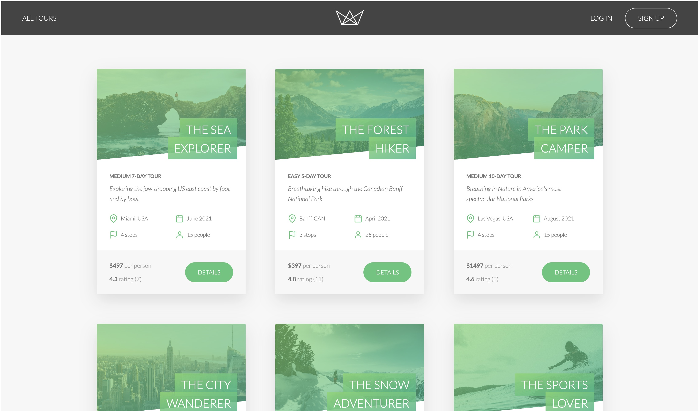

# Nandan's Homepage

[http://github.nandanjp.io/](http://github.nandanjp.io/)

# Natours

## Landing Page

## Description

- An Application all about nature and falling in love with it
- A Full Stack Application complete with an express backend which communicates with a MongoDB database through a custom REST Api and that serves server-rendered pug templates

## Stack

- [NodeJS](https://nodejs.org/en/) - "A back-end JavaScript runtime environment"
- [MongoDB](https://www.mongodb.com/) - A NoSQL server
- [Express.js](https://expressjs.com/) - "A fast, unopinionated, minimalist web framework for Node.js"
- [Tailwind CSS](https://tailwindcss.com/) - "A utility-first CSS framework packed with classes like flex, pt-4, text-center and rotate-90 that can be composed to build any design, directly in your markup."

## License

MIT License.

The inspiration of the design of the application along with the design practices utilized in the creation of this projection is credited to [Jonas Schmedtmann](https://codingheroes.io/).
